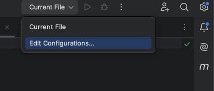

### Kotlin Gpio project. Working with IO lines on Raspberry Pi using Pi4J Kotlin/Java langs and remote compiling / debugging to any ARM GPIO compatible hardware. Advanced AI features (TensorFlow)


[All tutorails and videos on my YouTube channel](https://www.youtube.com/@OleksandrNeiko)


## Lesson 04: Hardware structure builder. Json config parsing.


#### Step 1: Create Avatar class. Implementation to interact with devices on physical level

````
/** main class to interact with hardware devices */
class Avatar {

    //res
    private lateinit var pi4J: Context
    private var configuration: Configuration? = null
    //hardware providers
    lateinit var body: Body
    lateinit var type: HardwareTypes.Type

    private fun init() {
        parseConfiguration()
    }


    fun build(pi4J: Context, configuration: Configuration): Avatar {
        this.pi4J = pi4J
        this.configuration = configuration
        init()
        return this
    }

    private fun parseConfiguration() {
        if (configuration == null) return

        when (configuration?.hardwareType) {

            HardwareTypes.CircuitBoard.JSON_TYPE_NAME -> {
                type = HardwareTypes.Type.CIRCUIT_BOARD
                body = CircuitBoardImpl(pi4J, configuration ?: Configuration())
            }

            HardwareTypes.WheelsRobot.JSON_TYPE_NAME -> {
                type = HardwareTypes.Type.WHEELS_ROBOT
                body = WheelsRobotImpl(pi4J, configuration ?: Configuration())
            }

        }
    }
}
````


#### Step 2: Create Companion Object to describe all hardware types for config parsing

````
package avatar.hardware

object HardwareTypes {

    enum class Type {
        UNKNOWN,
        CIRCUIT_BOARD,
        WHEELS_ROBOT
    }

    class CircuitBoard {
        companion object {
            const val JSON_TYPE_NAME = "circuitboard"
        }
    }

    class WheelsRobot {
        companion object {
            const val JSON_TYPE_NAME = "wheelsrobot"
        }
    }
}
````

#### Step 3: Create an interface for each specific hardware Type and implement those interfaces in classes

````
package avatar.hardware.types.circuitboard

import avatar.hardware.parts.Button
import avatar.hardware.parts.Led
import avatar.hardware.types.circuitboard.data.BodyCircuitBoard
import com.pi4j.context.Context
import kotlinx.coroutines.*
import runtime.setup.Configuration

class CircuitBoardImpl(private val pi4J: Context, private val configuration: Configuration): CircuitBoard {

    override var body: BodyCircuitBoard = BodyCircuitBoard()
        private set

    init {
        initHardware()
    }

    private fun initHardware() {

        //PARSE CONFIG

        /** init Leds */
        configuration.leds?.forEach {
            if (it?.pin != null) {
                body.leds.add(Led(pi4J, it))
            }
        }

        /** init Buttons */
        configuration.buttons?.forEach {
            if (it?.pin != null) {
                body.buttons.add(Button(pi4J, it))
            }
        }


    }


    override fun getLedsCount(): Int = body.leds.size

    override fun ledOn(ledPosition: Int, durationInMillis: Long): Boolean {
        if (ledPosition < 0 || ledPosition >= body.leds.size) return false
        /** multithreading job */
        body.leds[ledPosition].threadScope?.cancel()
        body.leds[ledPosition].threadScope = CoroutineScope(Job() + Dispatchers.IO).launch {
            if (ledPosition < body.leds.size) {
                body.leds[ledPosition].on()

                if (durationInMillis > 0L) {
                    delay(durationInMillis)
                    body.leds[ledPosition].off()
                }
            }
            this.cancel()
        }
        return true
    }

    override fun ledOff(ledPosition: Int): Boolean {
        if (ledPosition < 0 || ledPosition >= body.leds.size) return false
        if (ledPosition < body.leds.size) {
            body.leds[ledPosition].off()
            return true
        }
        return false
    }

    override fun getBatteryStatus(): Int {
        return 0
    }
}
````


#### Step 4: Create Data classes to interact with io devices directly and add it to shared Data class as body parts.

````
package avatar.hardware.parts

import com.pi4j.context.Context
import com.pi4j.io.gpio.digital.DigitalOutput
import com.pi4j.io.gpio.digital.DigitalOutputProvider
import kotlinx.coroutines.Job
import runtime.setup.Configuration

class Led(pi4j: Context, ledConfig: Configuration.LedConfig) {

    private lateinit var ledOutput: DigitalOutput
    private lateinit var name: String
    var threadScope: Job? = null

    init {
        buildLed(pi4j, ledConfig)
    }

    private fun buildLed(pi4j: Context, ledConfig: Configuration.LedConfig) {
        ledOutput = pi4j.digitalOutput<DigitalOutputProvider>().create(ledConfig.pin)
        name = ledConfig.name ?: "LED"
    }

    fun on() {
        ledOutput.high()
    }

    fun off() {
        ledOutput.low()
    }

}
````

#### Step 5: Create the builder for Avatar class
````
package avatar.hardware

import avatar.Avatar
import com.pi4j.context.Context
import runtime.setup.Configuration

class AvatarBuilder(private val pi4j: Context, private val configuration: Configuration) {

    fun build(): Avatar {
        val avatar = Avatar().build(pi4j, configuration)
        return avatar
    }
}
````

#### Step 6: Build Avatar in main thread in interact with in in real time execution
````
package org.example.runtime

import avatar.Avatar
import avatar.hardware.AvatarBuilder
import avatar.hardware.HardwareTypes
import avatar.hardware.types.circuitboard.CircuitBoard
import com.pi4j.context.Context
import com.pi4j.util.Console
import kotlinx.coroutines.coroutineScope
import kotlinx.coroutines.delay
import runtime.setup.Configuration
import runtime.setup.Injector


/**
 * LESSON 04: Hardware structure builder. Json config parsing.
 * GPIO-Kotlin-Pi4j project.
 * Kotlin Gpio project. Working with IO lines on Raspberry Pi using Pi4J Kotlin/Java langs and remote
 * compiling / debugging to any ARM GPIO compatible hardware. Advanced AI features (TensorFlow)
 */

//Hardware
lateinit var pi4j: Context
lateinit var console: Console
lateinit var configuration: Configuration
lateinit var avatar: Avatar

suspend fun main() {

    init()

    //Print out
    console.println(pi4j.boardInfo().boardModel)
    println(configuration)

    if (avatar.type == HardwareTypes.Type.CIRCUIT_BOARD) {
        println("led on")
        (avatar.body as CircuitBoard).ledOn(0, 5000L)
        delay(7000)
        (avatar.body as CircuitBoard).ledOn(0)
        (avatar.body as CircuitBoard).ledOn(1)
    }

    //add infinite loop for java app running
    coroutineScope {
        println("Start infinite main thread")
        delay(100_000_000L)
        println("End infinite main thread")
    }
}


fun init() {
    pi4j = Injector.getPi4j()
    console = Injector.getPi4jConsole()
    configuration = Injector.getRuntimeConfiguration().getConfiguration("lesson03config.json")
    avatar = AvatarBuilder(pi4j, configuration).build()
}

````


#### * Additional settings: remote compiling / debugging setup


Add new launch configuration to IntelliJ IDEA




fill IP / port adress to Raspberry PI. Username & password as sudo connection. Add Main Kotlin class and project module.


