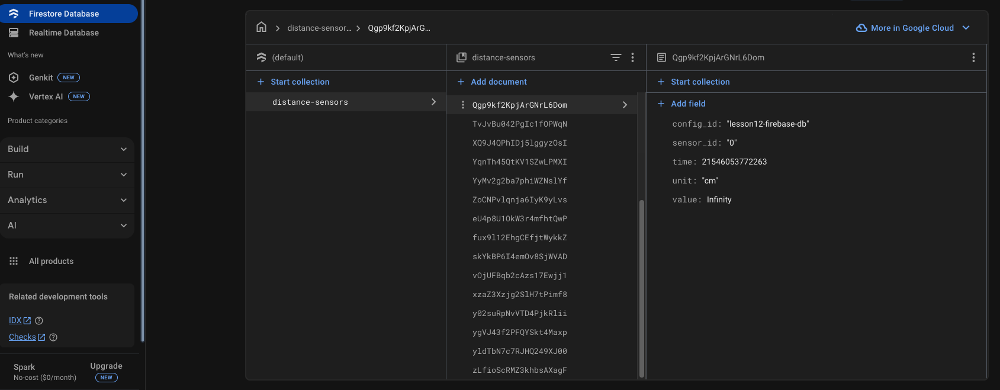

### Kotlin Gpio project. Working with IO lines on Raspberry Pi using Pi4J Kotlin/Java langs and remote compiling / debugging to any ARM GPIO compatible hardware. Advanced AI features (TensorFlow)


[All tutorails and videos on my YouTube channel](https://www.youtube.com/@OleksandrNeiko)


## LESSON 12: Firebase Database remote connection.

[Google Firebase](https://firebase.google.com/)


#### Step 1: Add Firebase dependency

````
   <dependency>
            <groupId>com.google.firebase</groupId>
            <artifactId>firebase-admin</artifactId>
            <version>9.4.3</version>
        </dependency>
````


#### Step 2: Setup your Firebase Firestore database. Create a collection and set fields types.





#### Step 3: Create interfaces, Firebase implementations for interaction with DB in 'network' package

````
package network.databases


interface DatabaseInitializer {

    fun initializeDatabase()

    fun read(tableName: String, data: Any?)

    fun write(tableName: String, data: Any)

    companion object {
        const val DB_TABLE_NAME_DISTANCE_SENSORS = "distance-sensors"

    }

}
````

````
package network.databases.firebase

import com.google.auth.oauth2.GoogleCredentials
import com.google.cloud.firestore.Firestore
import com.google.firebase.FirebaseApp
import com.google.firebase.FirebaseOptions
import com.google.firebase.cloud.FirestoreClient
import network.databases.DatabaseInitializer
import java.io.FileInputStream

class FirebaseFirestoreDatabase: DatabaseInitializer {

    private var db: Firestore? = null

    init {
        initializeDatabase()
    }

    override fun initializeDatabase() {

        try {

            val res = javaClass.classLoader.getResource("firebase-service-account.json")

            val serviceAccount = FileInputStream(res.path)

            val options = FirebaseOptions.Builder()
                .setCredentials(GoogleCredentials.fromStream(serviceAccount))
                .setDatabaseUrl("https://robotics-public-default-rtdb.firebaseio.com")
                .build()

            FirebaseApp.initializeApp(options)
            db = FirestoreClient.getFirestore()


        } catch (e: Exception) {
            println(e.message)
        }
    }


    override fun read(tableName: String, data: Any?) {
        //TODO
    }

    override fun write(tableName: String, data: Any) {
        try {
            if (db != null) {
                val collection = db!!.collection(tableName).document()
                collection.set(data)
            }
        } catch (_: Exception) {}
    }
}
````

````
package network.databases

import network.databases.firebase.FirebaseFirestoreDatabase

class DatabaseConnector(type: DatabaseTypes) {

    private lateinit var databaseConnector: DatabaseInitializer

    enum class DatabaseTypes() {
        FIREBASE_FIRESTORE_DB,
        LOCAL_DB,
    }

    init {
        when(type) {
            DatabaseTypes.FIREBASE_FIRESTORE_DB -> {
                databaseConnector = FirebaseFirestoreDatabase()
            }
            DatabaseTypes.LOCAL_DB -> {
                //TODO
            }
            else -> {
                databaseConnector = FirebaseFirestoreDatabase()
            }
        }
    }

    fun readFromDB(parameterName: String, key: Any?) {
        databaseConnector.read(parameterName, key)
    }

    fun writeToDB(tableName: String, data: Any) {
        databaseConnector.write(tableName, data)
    }

}
````

#### Step 4: Add data class related to remote DB table to write data to Firebase Firestore

````
package brain.data.remote

data class DistanceSensor(
    val config_id: String,
    val sensor_id: String,
    val time: Long,
    val unit: String,
    val value: Float,
    )

````

#### Step 5: Create 'Brain' class for all general logic (AI bridge between hardware and physical world) 

````
package brain

import avatar.Avatar
import brain.data.remote.DistanceSensor
import brain.emitters.DistanceEmitters
import brain.utils.toCm
import kotlinx.coroutines.*
import network.databases.DatabaseConnector
import network.databases.DatabaseInitializer

class Brain {

    private lateinit var avatar: Avatar
    private lateinit var dataBaseFirebaseFirestore: DatabaseConnector

    //Threads
    private var devicesThreadScopeArray: MutableMap<String, Job?> = mutableMapOf()

    private fun init() {
        initDatabases()
    }

    fun build(avatar: Avatar): Brain {
        this.avatar = avatar
        init()
        return this
    }

    private fun initDatabases() {
        dataBaseFirebaseFirestore = DatabaseConnector(type = DatabaseConnector.DatabaseTypes.FIREBASE_FIRESTORE_DB)
    }

    fun readFromMemory(parameterName: String, key: Any?) {
        dataBaseFirebaseFirestore.readFromDB(parameterName, key)
    }

    fun rememberToMemory(parameterName: String, data: Any) {
        dataBaseFirebaseFirestore.writeToDB(parameterName, data)
    }

    fun startTrackDevice(parameterName: String, devicePosition: Int? = null, loggingPeriodInMillis: Long = 1000) {
        when (parameterName) {
            PARAMETER_SENSOR_DISTANCE -> {
                subscribeToDistanceEmitters(devicePosition, loggingPeriodInMillis)
            }
        }
    }

    fun stopTrackDevice(parameterName: String, devicePosition: Int? = null) {
        devicesThreadScopeArray["$parameterName${devicePosition.toString()}"]?.cancel()
        devicesThreadScopeArray["$parameterName${devicePosition.toString()}"] = null
        devicesThreadScopeArray.remove("$parameterName${devicePosition.toString()}")
    }


    private fun subscribeToDistanceEmitters(sensorPosition: Int? = null, loggingPeriodInMillis: Long = 1000) {
        var launchTime = System.currentTimeMillis()
        val threadScope = CoroutineScope(Job() + Dispatchers.IO).launch {
            DistanceEmitters.distanceSensor.collect { distance ->
                if (System.currentTimeMillis() >= launchTime+loggingPeriodInMillis ) {
                    rememberToMemory(
                        parameterName = DatabaseInitializer.DB_TABLE_NAME_DISTANCE_SENSORS,
                        data = DistanceSensor(
                            config_id = avatar.configuration?.configName.toString(),
                            sensor_id = distance.sensorPosition.toString(),
                            time = distance.echoLowNanoTime,
                            unit = "cm",
                            value = distance.toCm()
                        )
                    )
                    launchTime = System.currentTimeMillis()
                }
            }

        }

        devicesThreadScopeArray["$PARAMETER_SENSOR_DISTANCE${sensorPosition.toString()}"] = threadScope
    }


    companion object {
        const val PARAMETER_SENSOR_DISTANCE = "sensorDistance"
        //add more...
    }

}
````
#### Step 6: Add builder class for 'Brain' instance

````
 package brain

import avatar.Avatar

class BrainBuilder(private val avatar: Avatar) {

    fun build() = Brain().build(avatar)

}
````

#### Step 7: Main thread logic. Init 'Brain' and push data to Firebase with periods

````
lateinit var brain: Brain


fun init() {
    pi4j = Injector.getPi4j()
    console = Injector.getPi4jConsole()
    configuration = Injector.getRuntimeConfiguration().getConfiguration("lesson12-firebase-db.json")
    avatar = AvatarBuilder(pi4j, configuration).build()
    brain = BrainBuilder(avatar = avatar).build()
}

   (avatar.body as CircuitBoard).startDistanceMeasuring(periodInMillis = 1000)
   ///////
   
   brain.stopTrackDevice(Brain.PARAMETER_SENSOR_DISTANCE)
     
````

#### * Additional settings: remote compiling / debugging setup


Add new launch configuration to IntelliJ IDEA


fill IP / port adress to Raspberry PI. Username & password as sudo connection. Add Main Kotlin class and project module.


